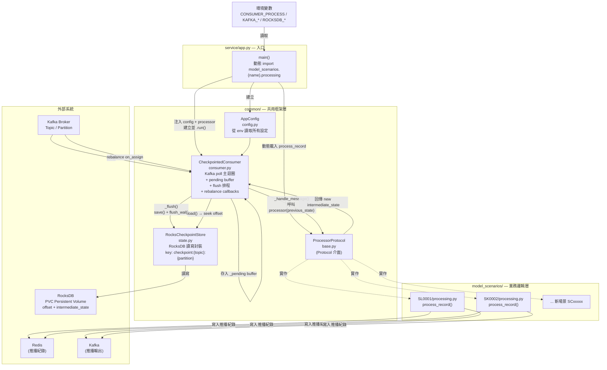

# RocksDict Kafka Checkpoint Consumer

這是一個 Python consumer 範例，使用：

- Python `3.12`（Dockerfile）／`3.14.4`（本機開發 pyproject.toml）
- `rocksdict==0.3.29`
- `confluent-kafka==2.14.0`

Consumer 會關閉 Kafka `enable.auto.commit`，每筆 Kafka message 處理完成後先暫存在記憶體，並依照「每 N 筆」或「每 X 秒」flush 到 RocksDB。RocksDB checkpoint 內容包含下一次要讀的 offset 和中間狀態。

## Architecture



### 文字流程說明

**① 啟動流程**

```
環境變數 (CONSUMER_PROCESS=SL0001, KAFKA_*, ROCKSDB_*)
    │
    ▼
service/app.py  main()
    ├─ AppConfig.from_env()          ← 讀取所有 Kafka / RocksDB 設定
    ├─ import model_scenarios.SL0001.processing.process_record
    └─ CheckpointedConsumer(config, processor).run()
            │
            ▼
        consumer.subscribe(topics)   ← 加入 Kafka Consumer Group
```

**② 訊息消費主流程**

```
Kafka Topic / Partition
    │
    │  poll()  每 1 秒
    ▼
CheckpointedConsumer._handle_message()   ← 共用框架層
    │
    │  呼叫 data_handle_before(previous_state)
    ▼
model_scenarios/{name}/data_handle_before.py     ← 資料前置業務邏輯層
    ├─ 靜態條件檢核
    ├─ 呼叫 process_record(previous_state, join_data)
    ▼
model_scenarios/{name}/processing.py     ← Model業務邏輯層
    ├─ 呼叫 Model
    ▼
model_scenarios/{name}/contact_policy.py    ← contact 推播頻率檢核邏輯層
    ├─ 近 2 天無推播檢核
    ▼
model_scenarios/{name}/data_handle_after.py    ← Redis寫入/Kafka推播輸出邏輯層
    ├─ 寫入 Redis / Kafka (推播輸出)
    └─ 回傳 new_intermediate_state
    ▼
_pending buffer (記憶體暫存)
    │
    │  每 N 筆 或 每 X 秒 → _flush()
    ▼
RocksCheckpointStore.save()              ← 共用框架層
    │
    ▼
RocksDB / PVC  (checkpoint:{topic}:{partition})
```

> **data_handle_after.py 載入規則**
> `data_handle_after.py` 採 fallback 設計：若 `model_scenarios/{name}/` 下有此檔案則優先使用（scenario 自訂邏輯）；否則 fallback 至 `common/data_handle_after.py`（預設實作，支援 Kafka 與 MongoDB 輸出）。

**③ Rebalance 流程**

```
Kafka Rebalance 事件
    │
    ├─ on_assign  → RocksDB.load()  → consumer.seek(上次 checkpoint offset)
    │                                                  │
    │                                                  ▼
    │                                          Kafka Topic (從斷點續讀)
    │
    └─ on_revoke  → _flush(force=True) → 清除 pending / active state
```

**④ 停止流程**

```
SIGINT / SIGTERM
    │
    ▼
_running = False
    │
    ▼
_flush(force=True)   ← 確保未提交狀態寫入 RocksDB
    │
    ▼
consumer.close()  +  store.close()
```

### 關鍵資料流

| 階段 | 流程 |
|------|------|
| **啟動** | `app.py` 讀 `CONSUMER_PROCESS` → 動態 import `process_record` → 建立 `AppConfig` + `CheckpointedConsumer` |
| **消費訊息** | Kafka `poll()` → `_handle_message()` → 呼叫 `process_record(previous_state)` → 存入 `_pending` |
| **Flush** | 達到 N 筆或 X 秒 → `_flush()` → `RocksCheckpointStore.save()` → RocksDB flush WAL |
| **Rebalance Assign** | `_on_assign()` → 從 RocksDB `load()` checkpoint → `seek` 到上次 offset |
| **Rebalance Revoke** | `_on_revoke()` → 強制 `_flush(force=True)` → 清除 pending / active state |
| **優雅停止** | SIGINT/SIGTERM → `_running=False` → 最終 `_flush(force=True)` → `consumer.close()` + `store.close()` |

---

## 批次並行處理（Batch + Concurrent）

`BATCH_SIZE > 1` 時啟用，consumer 改用 `consume(num_messages=BATCH_SIZE)` 一次抓多筆，再以三個 Phase 處理：

### 執行流程

```
consume(BATCH_SIZE=5) → 取得 5 筆訊息
    │
    ▼ 按 (topic, partition) 分組
    │
    ├─ Partition 0：[msg0, msg1, msg2] ──────┐
    │                                        │ ThreadPoolExecutor
    └─ Partition 1：[msg3, msg4] ────────────┘ （同時執行）
         │
         ▼ 每個 partition 各自執行三 Phase
         │
Phase 1  data_handle_before（循序）
         逐筆讀 previous_state → 靜態條件檢核 → 組裝 join_data
         │
         ▼ 收集所有 valid join_data
         │
Phase 2  process_batch / process_record（批次 Model 推論）
         ┌─ 有 process_batch → 一次送全部 valid 訊息給 Model
         └─ 無 process_batch → 逐筆呼叫 process_record（fallback）
         │
         ▼ 得到 model_results list
         │
Phase 3  contact_policy + data_handle_after（循序，含 skipped 訊息）
         依原始訊息順序逐筆處理，每筆重新讀 latest_prev：
         ├─ skipped → store_pending(latest_prev)
         ├─ contact_policy=False → store_pending(latest_prev)
         └─ 推播 → data_handle_after(latest_prev) → store_pending(new_state)
```

### 設計說明

| 項目 | 說明 |
|------|------|
| **partition 間並行** | 不同 partition 的三個 Phase 由 ThreadPoolExecutor 同時執行，互不干擾（state key 獨立） |
| **partition 內批次** | Phase 2 將同一 partition 的 valid 訊息打包送 Model，減少推論 RTT |
| **Phase 3 重新讀 latest_prev** | 確保 `processed_count` 等計數在同一 batch 內正確累積（非全部看相同的初始 state） |
| **skipped / blocked 訊息也進 Phase 3** | 確保每筆訊息的 offset 都往前推進，不遺漏任何 offset |
| **Lock** | `_pending` / `_active_states` / `_records_since_flush` 以 `threading.Lock` 保護並行寫入 |
| **BATCH_SIZE=1（預設）** | 退化為單筆循序處理，行為與原本相同，不影響現有部署 |

### Phase 1 的 previous_state 限制

Phase 1 的 `data_handle_before` 對 batch 內第 N 筆訊息，讀到的是**進入本 batch 前**的 state（非前 N-1 筆的結果），因為前面訊息的 model_result 要等到 Phase 2 才算出來。

**影響範圍**：若 `data_handle_before` 需要上一筆的輸出才能判斷（例如累積計數），在 batch 內會看到相同的初始值。**目前的實作中 `data_handle_before` 僅依賴 Kafka 訊息本身與靜態名單（不依賴 previous_state），此限制無影響。**

### 新增 process_batch

在 `processing.py` 中新增 `process_batch` function，consumer 啟動時自動偵測並啟用批次推論：

```python
def process_batch(*, batch: list[dict[str, Any]]) -> list[dict[str, Any]]:
    # batch items 格式：{topic, partition, offset, key, value, previous_state, join_data}
    # 回傳 list[model_result]，順序須與 batch 相同
    # 實際呼叫支援 batch 的 Model API：
    #   responses = model_client.batch_predict([item["join_data"] for item in batch])
    #   return responses
    return [process_record(**item) for item in batch]  # fallback
```

---

## 架構重點

RocksDB 在這裡負責：

- Offset 管理：記錄每個 `topic + partition` 已安全處理完成後的 `next_offset`
- Checkpoint：每 N 筆或每 X 秒保存安全點
- 中間狀態：保存 processing function 回傳的 state

多個 pod 讀同一個 topic 時，請使用相同 `group.id`。Kafka 會把同一個 consumer group 內的 partition 分配給不同 pod；同一個 partition 同時間只會由其中一個 pod 消費。

重要限制：如果 RocksDB 放在 pod 本機 ephemeral disk，partition rebalance 到另一個 pod 時，那個 pod 可能沒有該 partition 的 RocksDB checkpoint。正式環境要避免這個問題，通常會選其中一種：

- 每個 pod 掛 persistent volume，並設計 partition 與 state 的搬移策略
- 保留 RocksDB 作為本機 state store，同時設定 `COMMIT_KAFKA_OFFSETS=true`，在 RocksDB checkpoint flush 成功後才手動 commit Kafka offset，讓 consumer group rebalance 有共同 offset 可用
- 使用外部共享 state store 保存 checkpoint

此範例預設 `COMMIT_KAFKA_OFFSETS=false`，符合「不依賴 Kafka auto.commit」。要支援多 pod rebalance 更穩定，建議在部署時改為 `true`；這仍然是手動 commit，不是 auto commit。

## 專案結構

```
model-stearming-code-pvc/code/            # container 內掛載至 /app
├── common/                               # 共用框架層
│   ├── base.py                           # ProcessorProtocol 介面定義
│   ├── config.py                         # Kafka / RocksDB 設定（從環境變數讀取）
│   ├── consumer.py                       # Kafka poll + RocksDB checkpoint 核心邏輯
│   ├── state.py                          # RocksDB state store（PartitionState / RocksCheckpointStore）
│   └── data_handle_after.py              # 預設推播輸出（支援 Kafka / MongoDB）
│
├── service/                              # 服務啟動層
│   └── app.py                            # 入口：讀 CONSUMER_PROCESS 動態載入對應 processing
│
└── model_scenarios/                      # 各業務場景（每個目錄為獨立專案）
    ├── SL0001/
    │   ├── processing.py                 # Model 推論邏輯，實作 ProcessorProtocol
    │   ├── data_handle_before.py         # (optional) 靜態條件檢核 + 資料 join
    │   ├── contact_policy.py             # (optional) 推播頻率檢核（近 2 天）
    │   └── data_handle_after.py          # (optional) 覆寫預設推播輸出
    └── SCXXXXX/                          # 新場景範本（複製此目錄作為起點）
        ├── processing.py                 # Model 推論邏輯（必填）
        ├── data_handle_before.py         # (optional) 靜態條件檢核 + 資料 join
        ├── contact_policy.py             # (optional) 推播頻率檢核
        └── data_handle_after.py          # (optional) 覆寫預設推播輸出
```

## 安裝（本機開發）

```powershell
py -3.14 -m venv .venv
.\.venv\Scripts\Activate.ps1
python -m pip install --upgrade pip
python -m pip install -e .
```

安裝後可直接執行：

```powershell
$env:CONSUMER_PROCESS="SL0001"
consumer
```

或不安裝直接跑：

```powershell
cd model-stearming-code-pvc/code
python -m service.app
```

## 環境變數

| 變數 | 說明 | 預設值 |
|------|------|--------|
| `CONSUMER_PROCESS` | 要載入的 model_scenarios 目錄名稱 | **必填** |
| `KAFKA_BOOTSTRAP_SERVERS` | Kafka broker 位址 | `localhost:9092` |
| `KAFKA_GROUP_ID` | Consumer group ID | `rocksdict-checkpoint-consumer` |
| `KAFKA_TOPICS` | 訂閱的 topic，逗號分隔 | `CCARDTD_STREAM_FINAL` |
| `KAFKA_AUTO_OFFSET_RESET` | offset 重置策略 | `earliest` |
| `ROCKSDB_PATH` | RocksDB 存放目錄 | `./data/checkpoints` |
| `CHECKPOINT_EVERY_RECORDS` | 每幾筆 flush 一次 | `1000` |
| `CHECKPOINT_EVERY_SECONDS` | 每幾秒 flush 一次 | `5` |
| `COMMIT_KAFKA_OFFSETS` | 是否同步手動 commit Kafka offset | `false` |
| `POLL_TIMEOUT_SECONDS` | Kafka poll 等待時間 | `1.0` |
| `BATCH_SIZE` | 每次 consume 的最大訊息數（批次並行處理） | `1` |

各 process 可在自己的 `processing.py` 內讀取專屬環境變數。

## Docker Compose

`docker-compose.yaml` 會啟動以下服務：

| 服務 | 說明 |
|------|------|
| `kafka` | KRaft 模式的 Kafka broker，container 內 `kafka:29092`，本機 `localhost:9092` |
| `kafka-init` | 一次性 job，建立 `Click` topic（2 partitions），確保 consumer 啟動前 topic 已存在 |
| `akhq` | Kafka UI，http://localhost:8080 |
| `consumer1` | kafka-consumer container，訂閱 `Click` topic，`CONSUMER_PROCESS=SL0001` |
| `consumer2` | 同上，與 `consumer1` 同一個 group，Kafka 自動分配不同 partition |

啟動：

```powershell
docker compose up --build
```

送一筆測試資料：

```powershell
docker compose exec kafka kafka-console-producer --bootstrap-server kafka:29092 --topic Click
```

輸入一行 JSON 後按 Enter：

```json
{"card_id":"demo-1","amount":123}
```

查看 consumer log：

```powershell
docker compose logs -f consumer1
docker compose logs -f consumer2
```

## Consumer Group 分配機制

Kafka 以 **partition** 為最小分配單位，同一個 consumer group 裡每個 partition 同時間只會交給一個 consumer 處理，因此多個 consumer 使用相同 `KAFKA_GROUP_ID` 就能自動切割資料、不重複消費。

```
Topic: Click（2 partitions）
                    ┌──────────────────────────────────┐
                    │   KAFKA_GROUP_ID: kafka-consumer  │
                    │                                  │
Partition 0 ───────▶│  consumer1 (SL0001)              │
Partition 1 ───────▶│  consumer2 (SK0002)              │
                    └──────────────────────────────────┘
```

### 分配規則

| 情況 | 結果 |
|------|------|
| consumer 數 = partition 數 | 每個 consumer 負責一個 partition（最佳） |
| consumer 數 < partition 數 | 部分 consumer 負責多個 partition |
| consumer 數 > partition 數 | 多出來的 consumer 閒置待命（rebalance 時頂上） |

### 為什麼需要 kafka-init

`KAFKA_AUTO_CREATE_TOPICS_ENABLE: "true"` 讓 Kafka 在 consumer 第一次訂閱時自動建立 topic，但**預設只有 1 個 partition**。兩個 consumer 搶同一個 partition，只有一個能消費，另一個閒置。

`kafka-init` 在 consumer 啟動前先以 `--partitions 2` 建好 topic，確保兩個 consumer 都能分配到獨立的 partition。

擴充 consumer 數量時，需同步調整 `kafka-init` 的 `--partitions`：

```yaml
kafka-topics ... --topic Click --partitions <consumer 數量>
```

### 不同 Group 的行為（對照）

如果兩個 consumer 使用**不同** `KAFKA_GROUP_ID`，Kafka 會把完整的 topic 資料各自推送給每個 group，兩邊都會收到全量資料。這適合「同一份資料給不同系統各自處理」的場景，但在同一個服務裡多開 replica 時要避免。

## 多 Process 架構（Plugin 設計）

`common/` 為共用框架，業務邏輯由各 `model_scenarios/` 目錄自行定義。`service/app.py` 在啟動時讀取 `CONSUMER_PROCESS` 環境變數，動態 import 對應的 `processing.py`：

```
CONSUMER_PROCESS=SL0001  →  model_scenarios.SL0001.processing.process_record
CONSUMER_PROCESS=SL0002  →  model_scenarios.SL0002.processing.process_record
```

### 新增一個 process

1. 在 `model_scenarios/` 下建立新目錄，例如 `SL0002/`
2. 新增 `__init__.py` 和 `processing.py`，實作符合 `ProcessorProtocol` 的 `process_record` function
3. k8s Deployment 或 docker-compose 設定 `CONSUMER_PROCESS=SL0002`

### K8s 水平擴展

- 每個 process 對應一個獨立的 k8s Deployment
- 同一個 Deployment 可開多個 replica，Kafka consumer group 自動分配 partition
- 不同 Deployment 使用不同 `KAFKA_GROUP_ID`

### `process_record` 介面

```python
def process_record(
    *,
    topic: str,
    partition: int,
    offset: int,
    key: bytes | None,
    value: bytes | None,
    previous_state: dict[str, Any] | None,
) -> dict[str, Any]:
    ...
```

回傳的 dict 會作為中間狀態與 offset 一起寫入 RocksDB checkpoint。

## Checkpoint 格式

RocksDB key：

```
checkpoint:{topic}:{partition}
```

Value 是 JSON：

```json
{
  "topic": "Click",
  "partition": 0,
  "next_offset": 1235,
  "intermediate_state": {
    "processed_count": 1235
  },
  "updated_at": 1770000000.0
}
```

`next_offset` 使用 Kafka 慣例：處理完成 offset `1234` 之後，checkpoint 記錄下一次要讀取的 offset `1235`。

## Kubernetes 多 pod 提醒

- 所有 pod 使用相同 `KAFKA_GROUP_ID`
- pod 數量超過 topic partition 數不會增加吞吐量；同一個 consumer group 最大平行度是 partition 數
- `ROCKSDB_PATH` 在容器內應指到可寫目錄（建議掛 persistent volume）
- 如果依賴 RocksDB checkpoint 做 restart/rebalance recovery，請搭配 `COMMIT_KAFKA_OFFSETS=true`
